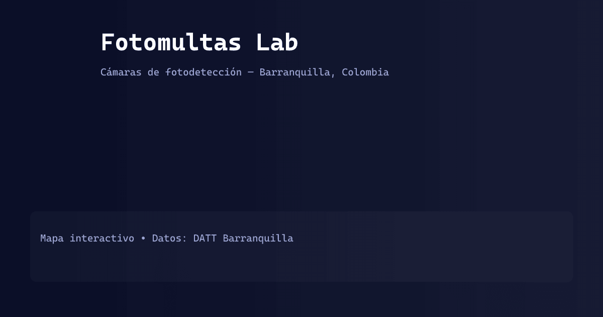

# Fotomultas Lab



**Mapa interactivo de cámaras de fotodetección en Barranquilla, Colombia** — ¿Dónde están las cámaras y qué tipo son?

 

🔗 **Demo pública:** https://yamicueto.github.io/fotomultaslab/

---

## 🚨 Problema

¿Dónde están ubicadas las cámaras de fotodetección en la ciudad? La información oficial suele estar en formatos difíciles de consultar por ciudadanos (PDFs, tablas, portales desactualizados).

## ✅ Nuestra solución

Visualización interactiva open-source que muestra la ubicación exacta y tipo de cámaras (velocidad, luz roja, cruce). Datos abiertos del gobierno transformados en una herramienta útil para la comunidad.

## 📊 Fuentes de datos

- **Gobierno:** Datos abiertos DATT Barranquilla / Secretaría de Tránsito
- **Formato:** JSON local normalizado (`data/camaras.json`)
- **Actualización:** Oct 2025 (última publicación oficial)

Consulta [DATA.md](./DATA.md) para detalles del schema y cómo actualizar.

---

## ✨ Características principales

- Mapa interactivo con Leaflet y agrupamiento de marcadores (MarkerCluster).
- Búsqueda difusa con Fuse.js (con fallback simple si la librería no está disponible).
- Filtros por tipo de cámara (Velocidad, Luz roja, Cruce).
- Animaciones UI con GSAP y contador animado.
- PWA mínima: `manifest.json` y `sw.js` para instalación básica y cacheo.
- Tour/stepper integrado para nuevos usuarios.

Estructura del proyecto

- `index.html` — Interfaz principal (header, sidebar, mapa)
- `style.css` — Variables de diseño (modo oscuro), componentes y responsive
- `script.js` — Lógica: carga/normalización de `data/camaras.json`, inicialización de Leaflet, MarkerCluster, Fuse (búsqueda) y animaciones GSAP
- `data/camaras.json` — Dataset local con ubicaciones y metadatos
- `assets/` — Iconos SVG, PNG y logo
- `manifest.json`, `sw.js` — PWA
- `scripts/generate_icons.js` — helper Node (sharp) para generar PNGs desde SVG

Requisitos

- Navegador moderno (Chrome/Firefox/Edge/Safari — últimas versiones)
- Node (opcional) si deseas generar iconos con `scripts/generate_icons.js`

Probar localmente

Sirve la carpeta del proyecto con un servidor estático (evitar abrir `file://`). Ejemplos:

```powershell
# Python (rápido)
python -m http.server 8000
# abrir http://127.0.0.1:8000

# O con npm (http-server)
npx http-server -c-1
```

Generar PNGs para manifest / social preview

Se añadió `assets/og-image.svg` y un script `scripts/generate_icons.js` que usa `sharp` para crear:

- `assets/logo-192.png` (192×192) — usado como `apple-touch-icon` / favicon fallback
- `assets/logo-512.png` (512×512) — usado por el manifest
- `assets/og-image.png` (1200×630) — imagen para redes sociales

Para generar localmente:

```powershell
cd C:\ruta\a\fotomultaslab
npm install
npm install sharp --no-audit --no-fund
node scripts\generate_icons.js
```

También incluí un script de Windows `scripts/generate_icons.cmd` que usa ImageMagick si lo prefieres.

PWA y manifiesto

- `manifest.json` y `sw.js` están configurados para funcionar cuando el sitio se sirve en un subpath (por ejemplo GitHub Pages `/fotomultaslab/`) y en desarrollo local. Si ves iconos 404, limpia el Service Worker desde DevTools → Application → Service Workers → Unregister y borra el storage.
- Si quieres que el site sea la página principal (`yamicueto.github.io`) las rutas en el manifest deben actualizarse (actualmente funcionan con rutas relativas).

Tour/Step-by-step

- Al primer acceso el tour se muestra automáticamente (persistencia en `localStorage`) y explica búsqueda, filtros, clusters, ubicación y cómo instalar la PWA.

Depuración rápida

- Si Fuse.js no carga por CDN, el proyecto usa un fallback simple (búsqueda por substring). Revisa la consola para ver avisos.
- Si el Service Worker lanza errores por `cache.put` con esquemas extraños (ej. chrome-extension://), eso está mitigado en `sw.js`.

## 🗺️ Roadmap

- **Corto plazo:** Alertas por zona — notificaciones cuando se publique actualización del dataset oficial
- **Medio plazo:** Panel estadístico (conteo por barrio/tipo), export CSV
- **Largo plazo:** Replicar plantilla a otras ciudades colombianas (Bogotá, Medellín, Cali)

Consulta [EXPANSION_TEMPLATE.md](./EXPANSION_TEMPLATE.md) para guía de replicación.

---

## 🤝 Contribuir

¿Tienes datos actualizados, correcciones o mejoras? Lee [CONTRIBUTING.md](./CONTRIBUTING.md) y abre un _issue_ o _pull request_.

**Llamada a la acción:** Si tienes acceso a datos de tu ciudad, ayúdanos a expandir este proyecto cívico. Transparencia + comunidad = impacto.

### Formato de muestra para `data/camaras.json`

```json
{
  "nombre": "Calle 50 con Carrera 46",
  "tipo": "VELOCIDAD",
  "direccion": "Cll 50 #46-21",
  "latitud": "10.96854",
  "longitud": "-74.78132",
  "fuente": "https://datos.barranquilla.gov.co/...",
  "fecha_actualizacion": "2025-10-01"
}
```

---

## 📄 Licencia

MIT © 2025 YamiCueto

**Nota:** Este es un proyecto comunitario independiente. Los datos provienen de fuentes oficiales públicas y se presentan sin garantías. Verifica siempre la señalización oficial en las vías.
